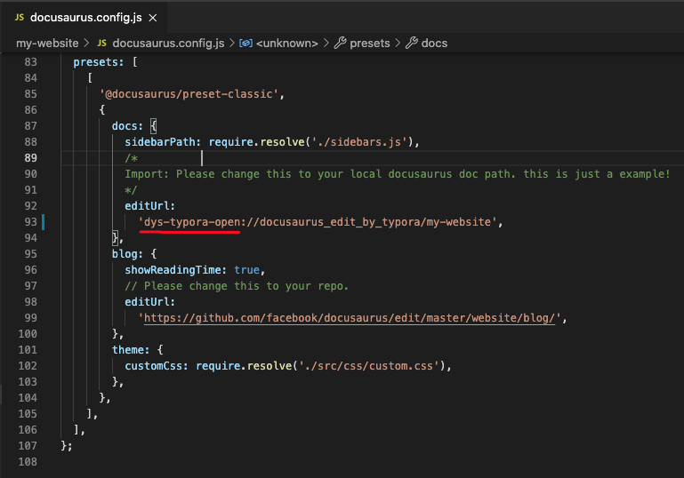
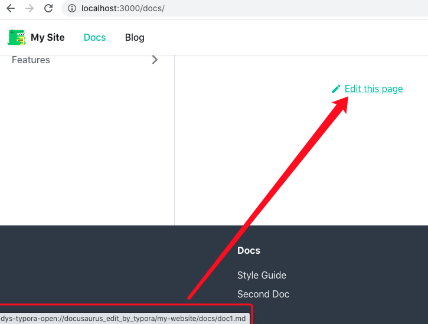

## What is this?

`dys-typora-open` is a bridge tool of Typora and your docusaurus, it can enable you edit you markdown files with Typora from browser。 

```
.
├── README.md
├── dys-typora-open			// the source code of dys-typora-open.app
│   ├── README.assets
│   ├── dys-typora-open
│   └── dys-typora-open.xcodeproj
├── dys-typora-open.app // it's a bradge of Typora and your docusaurus
│   └── Contents
└── my-website					// a docusaurus example to show how to config Typora to edit markdown files.
    ├── README.md
    ├── babel.config.js
    ├── blog
    ├── build
    ├── docs
    ├── docusaurus.config.js
    ├── package.json
    ├── sidebars.js
    ├── src
    ├── static
    └── yarn.lock
    
```


## Setup

1. move `dys-typora-open.app` to your Application Folder
2. edit you docusaurus.config.js->presets->docs->editUrl to your docusaurus path。
3. 



dys-typora-open base on your home directory。click `edit this page ` it will call Typora to open doc1.md ,then you can edit it happily with Typora!


---


##  这是个什么东西？

`dys-typora-open` 工具是 Typora 和 docusaurus之间的一个桥接工具，他可以让你在浏览器中直接调用typora打开对应的md文档，进行编辑。`dys-typora-open`的源码也在里面，可以放心使用。

我的使用场景是：使用docusaurus 作为我的私人笔记本，查看笔记的时候，如果想编辑，可以点击页面下面的`edit this page`  直接打开对应的MD文档，方便整理文档。


```
.
├── README.md
├── dys-typora-open			// dys-typora-open.app 的源码
│   ├── README.assets
│   ├── dys-typora-open
│   └── dys-typora-open.xcodeproj
├── dys-typora-open.app // Typora 和 你的 docusaurus 文档的桥接工具
│   └── Contents
└── my-website					// 一个简单的展示怎么配置docusaurus 去使用dys-typora-open的demo
    ├── README.md
    ├── babel.config.js
    ├── blog
    ├── build
    ├── docs
    ├── docusaurus.config.js
    ├── package.json
    ├── sidebars.js
    ├── src
    ├── static
    └── yarn.lock
```


## 设置


1. 把 `dys-typora-open.app`  放到你的应用程序文件夹
2. 编辑 docusaurus.config.js->presets->docs->editUrl 其中scheme是`dys-typora-open to`后面的路径是你的 docusaurus 文件夹路径。
3. 


dys-typora-open 是基于你的家目录的。配置好后启动docusaurus 点击 `edit this page ` 将会调用typora打开对应的md文档 ,然后就可以愉快的使用Typora来编辑了！

