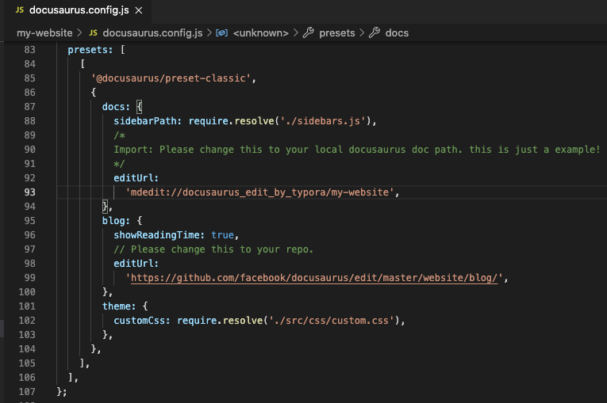
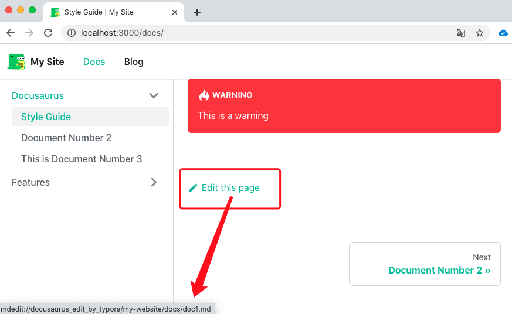

## What is this?

EditMarkDown is a bridge tool of Typora and your docusaurus, it can enable you edit you markdown files with Typora from browser。 

```
.
├── EditMarkDown.app// it's a bradge of Typora and your docusaurus
├── README.md
├── mdedit					// the source code of EditMarkDown.app
│   ├── EditMarkDown
│   ├── EditMarkDown.xcodeproj
│   └── README.md
└── my-website			// a docusaurus example to show how to config Typora to edit markdown files.
    ├── README.md
    ├── babel.config.js
    ├── blog
    ├── docs
    ├── docusaurus.config.js
    ├── package.json
    ├── sidebars.js
    ├── src
    ├── static
    └── yarn.lock
```


## Setup

1. move `EditMarkDown.app` to your Application Folder
2. edit you docusaurus.config.js->presets->docs->editUrl to your docusaurus path。






EditMarkDown base on your home directory。click `edit this page ` it will call Typora to open doc1.md ,then you can edit it happily with Typora!